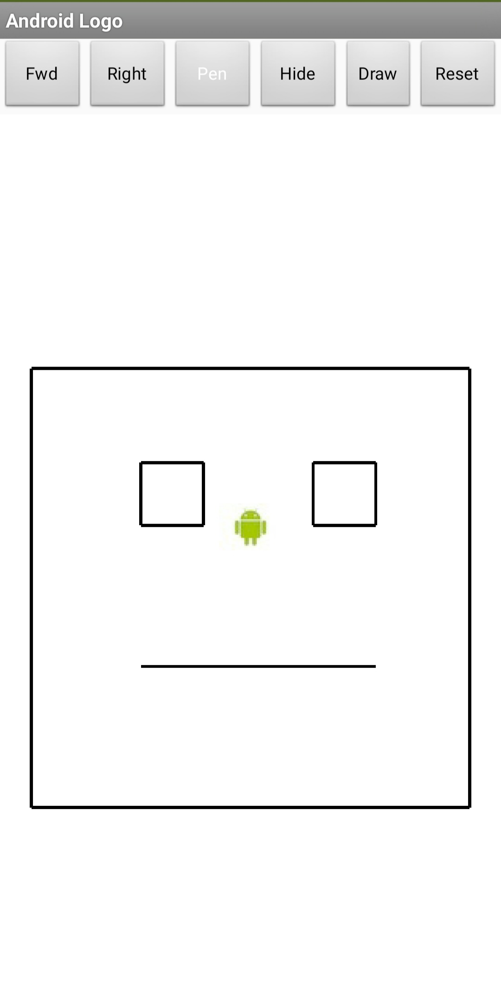
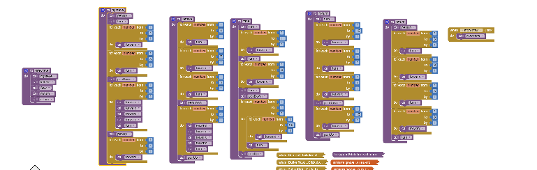

# 4.4 Reflection Questions

### 1. You can take a screenshot on most Android devices by pressing the power button and the volume down button at the same time and then emailing the photo from the gallery to yourself, or uploading the image to Google Drive.

#### a. Insert a screenshot from your device of your app's face drawing.

#### b. Insert a screenshot of the AppInventor code that creates the face drawing and includes the procedure and loop.

### 2. Describe in general what the drawFace procedure does.

[The drawFace procedure uses a series of pen raises, lowers, forward movements, and right turns to draw a robot face.]

### 3. Describe how the drawFace procedure contributes to the overall functionality of the program.

[The procedure contributes to the overall fuctionality because it can easily be called at any moment, is easy enough to read and understand, and it returns the android back to the starting position. ]

### 4. Explain in detailed steps how the algorithm implemented in your drawFace procedure works. Your explanation must be detailed enough for someone else to recreate it.

[My drawFace procedure works by first drawing the right eye, which it does by lifting the pen, turning, moving forward to get into position, turning more to position, lowering the pen, drawing a square by moving forward four times and turning in a loop four times, then raising the pen. It then repositions by moving forward, turning 3 times, and moving forward some more, before drawing the exact same square as before by lowering the pen and repeating the procedure before rasiing. It then turns to face the left side of the screen, moves forward 11 times to get close to it before turning right and moving forward to position itself in the top right corner from which it draws a big sqaure for the face. Finally the robot turns and moves down a bit past the eyes before turning to move towards the direction of the eyes, and only lowering the pen for a little bit and moving forward to create the mouth. After this, the robot turns and moves forward upwards, before turning again and moving forwards a little more to get back to the starting position, where it repositions facing upwards.]

### 5. What weaknesses do you find in using the procedures (the abstractions) we gave you -- forward, turn -- for drawing simple shapes? How would you change the definitions of these procedures to make it easier to draw shapes? Give a specific example that illustrates how a more powerful set of procedures would improve things.

[The forward and turn procedures are limited since it only allows forward movement and right turns. I would change the definition to allow for a size input for the move forward so that I can easily draw straight lines, or for an angle input for the right turn. This would allow for the creation of diagonal lines for more complex shapes like diamonds in squares, while the forward size input will make it faster to draw the shapes.]

> ***Don't forget to upload both your .apk and .aia files for this work to your repo.***
