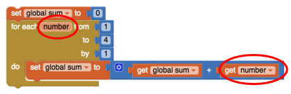

# 4.5 Reflection Questions

### 1. Write an **if/else** statement to express the following real life situation.  Mary likes ice cream and always chooses chocolate unless there is no chocolate in which case she chooses strawberry.  But if there’s no strawberry either then she settles for vanilla, which, for some reason, is always available.

[If there is chocalate: Mary will choose chocoalte. If else there is strawberry: Mary will choose strawberry. Else: Mary will choose vanilla.]

### 2. We didn’t need it for the loop in this lesson, but the *number element* in the *For each number* loop is a local variable whose value changes automatically on each iteration of the loop. For example, in this loop number would start at 1 and then go to 2, 3 and 4. And this value can be used in the body of the loop, as shown in this example. Given that, trace through this loop and figure out what value global *sum* would have when the loop finishes.

[Replace this with your answer]

### 3. App Inventor’s random-integer block is an abstract *model of randomness* -- i.e., an abstraction of real randomness such as flipping a real coin. What would you say about the random-integer block if you ran the coin flipping simulation 10,000 times and the result was that it came up heads 55% of the time?

[I would say that the random-integer block may need to be improved a little because at that high of a number, the coin should be closer to 50% heads by a fair bit, even if the randomness is simulated.]

>Don't forget your properly named ***.apk*** and ***.aia*** files uploaded to the repo!
