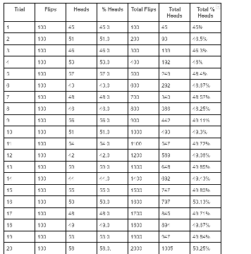

# 4.6 Reflection Questions

### 1. **(POGIL)** Record your team's results for each run in a neatly organized table. That is, if you did 20 runs of 100 coin flips each, your table should have 20 rows of results, with percentages for each row and totals at the bottom. Include your table here.

### 2. **(POGIL)** According to your results, does App Inventor's PRNG provide a good model of randomness?

[App Inventor's PRNG does provide a good model of randomness because the trial showed that probablity of landing on either heads or tails was close enough to 50% that it is acceptable.]

### 3. **(POGIL)** A friend claims that flipping a coin 100 times and finding that it comes up heads only 45% of the time shows that the coin is biased. How should you reply?

[I would tell them to try flipping a thousand more times because the sample size of coin flips was a little limited and may have been the reason that the coin appeared biased.]

### 4. Because we are using a coin flip app, this experiment really tests only that App Inventor's random integer block generates a 1 around half the time. Is this a sufficient test for App Inventor's PRNG? What other experiments might you do to increase your confidence in App Inventor’s PRNG?

[To increase my confidence of the PRNG I would run experiments like this but with more and more variabels, and I would say if the results were close to the predicted values. If app inventor gives good results even with 10 variables, then I would have good confidence in the PRNG.]

Link to your Google Doc for the POGIL Activity here: [POGIL Activity](https://docs.google.com/document/d/1mFphhcvN7wkF3b6F1TACgmVaoiE7UsEpcKm1dStLEyU/edit?usp=sharing).

> Your POGIL document often contains the same questions as the reflection; however, the reflection questions here should contain your ***refined*** responses after working with your group.
