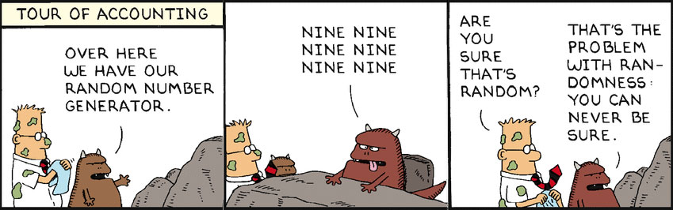

# 4.7 Reflection Questions

### 1. Consider the following Dilbert cartoon. Would it be possible for a PRNG to spit out 6 NINEs in a row?

[Replace this with your answer]

### 2. Are slot machines fair? Why or why not?

[Replace this with your answer]

### 3. Is it possible to devise a method that would allow you to win consistently on a slot machine?

[Replace this with your answer]
